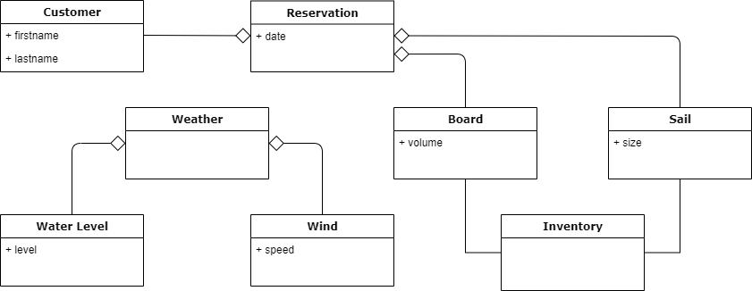

# *Windsurfer's Paradise* -  a modular fullstack application showcase
 In this modular fullstack sample application a windsurf rental software is implemented in TypeScript and Kotlin. Frameworks in use are Spring Boot, Angular and Feign.

### Domain

*Windsurfer's Paradise* is a (fictional) rental station on Mauritus. In order to surf here you need ...
- ... high tide in the lagoon to avoid getting get scratches (not only on your surfboard).
- ... moderate to strong wind from the north or the south.
- ... a reservation at our shop :)  

### Getting started

1. Clone the repository
2. Import the project in your IDE
3. Build the project using `gradlew build`
4. Run the backend applications `SurfshopApplication` and `WeatherServiceApplication`
5. Run the frontend using `setupNode.cmd` followed by `npm start` in the `webapp` directory.
6. Launch http://localhost:4200 to see the shop 
