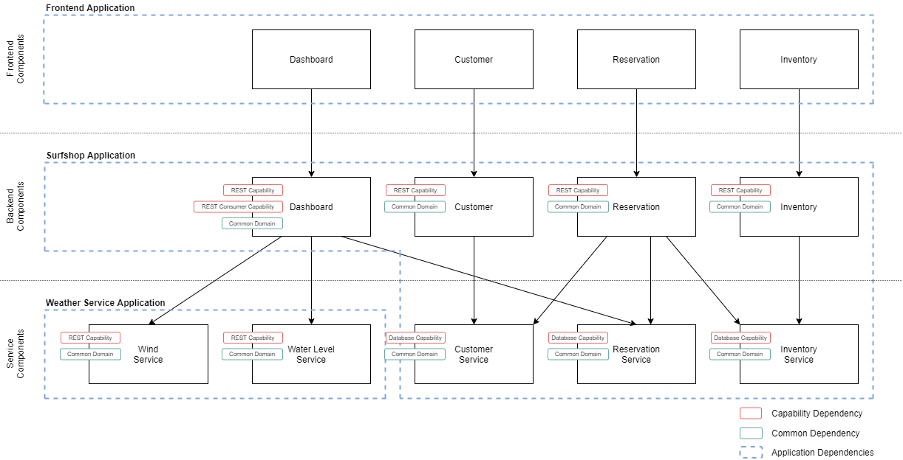

# Surfshop - a modular fullstack application showcase
 In this modular fullstack sample application a windsurf rental software is implemented in TypeScript and Kotlin. Frameworks in use are:
  - [Spring Boot](https://spring.io/projects/spring-boot)
  - [Angular](https://angular.io/)
  - [Feign](https://github.com/OpenFeign/feign)
  - [H2 database](https://www.h2database.com/html/main.html)
  - [Flyway](https://flywaydb.org/)

### Domain

*Windsurfer's Paradise* is a (fictional) rental station on Mauritus. In order to surf here you need ...
- ... high tide in the lagoon to avoid getting get scratches (not only on your surfboard).
- ... moderate to strong wind from the north or the south.
- ... a reservation at the shop :)  

### Modules & Components

**Functional** modules are first-class citizens in the project folder structure. Backend modules and their dependencies are enforced with Gradle.

 
**Common** modules are libraries with shared classes, logic and domain value objects. Typically they are free of framework code.

**Capability** modules are used to adds behaviour to context and/or configures the framework of the module. A module with a missing capability dependency may still compile, but behave differently because the capability .

**Application** modules only contain the main class with a `@SpringBootApplication` annotation, the module dependencies define what is packaged and run with it.
### Getting started

1. Clone the repository
2. Import the project in your IDE
3. Build the project using `gradlew build`
4. Run the backend applications `SurfshopApplication` and `WeatherServiceApplication`
5. Run the frontend using `setupNode.cmd` followed by `npm install` and `npm start` in the `webapp` directory.
6. Launch http://localhost:4200 to see the shop 
